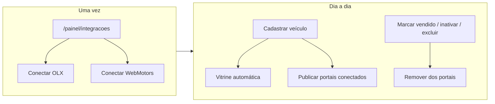

# Classificados — blueprint OLX e WebMotors

Fonte de verdade operacional para integradores de anúncios. PRD resumido em `apps/admin-master/content/internal-docs/regras-de-negocio.md`; trace técnica em `documentacao-tecnica.md`.

**Meta (Instagram/Facebook):** fora deste documento — ver `META_INTEGRATION_SIMPLIFIED.md`.

---

## 1. Visão em uma frase

**Dois módulos SaaS independentes** (`olx_sync`, `webmotors_sync`), **dois portais**, um fluxo: o plano define **quais** integradores a loja pode usar → o gestor **só conecta** os portais que comprou → cada veículo elegível **publica sozinho** na vitrine + portais conectados **e habilitados no plano** → ao sair do estoque **remove sozinho** desses portais.

> **Atualização 2026-06-24:** integrações classificados limitam-se a OLX e WebMotors.

**Não** obrigar OAuth nem conta em portal sem módulo no plano.

---

## 2. Módulos e planos (decisão PM 2026-06-11 — revisão)

| Portal | Chave SaaS | Label catálogo (admin) |
| --- | --- | --- |
| OLX | `olx_sync` | Integração OLX |
| WebMotors | `webmotors_sync` | Integração WebMotors |

| Item | Valor |
| --- | --- |
| **Gating por portal** | `isClassifiedsProviderModuleEnabled(resolvedKeys, provider)` — ver `packages/shared/src/lib/dealership-features.ts` |
| **Legado** | `classifieds_sync` permanece como **bundle** temporário: se presente no plano, trata como OLX + WebMotors ligados (migração copia pivôs; código aceita ambos até descontinuar o bundle) |
| **Hub Integrações** | Mostrar **apenas** cards cujo módulo está no plano — loja sem `webmotors_sync` **não vê** card WebMotors |
| **Auto-publish** | Enfileira só portais **conectados** **e** com módulo ativo — nunca força portal não contratado |
| **Plano típico** | Enterprise demo pode ter os três; planos custom podem ter só OLX, só WM, etc. |

### Exemplos comerciais

| Plano | Módulos classificados | UX lojista |
| --- | --- | --- |
| Starter / Business | *(nenhum)* | Sem secção Integrações / sem cards classificados |
| «Premium OLX» | `olx_sync` | Só card OLX; auto-publish só OLX se conectado |
| «Premium WM + OLX» | `olx_sync`, `webmotors_sync` | Dois cards; escolhe conectar um ou ambos |
| Enterprise completo | `olx_sync`, `webmotors_sync` (ou legado `classifieds_sync`) | Dois cards disponíveis |

---

## 3. Fluxo do lojista (objetivo UX)



### 3.1 Conectar (setup)

1. Gestor abre **Integrações** (`/painel/integracoes`) — página visível se **qualquer** módulo classificados ou Meta estiver no plano.
2. Vê **somente** cards dos portais incluídos no plano (ex.: só OLX se só `olx_sync`).
3. Clica **Conectar** no card desejado → popup OAuth oficial → status **Conectado**.
4. **Não** precisa conectar (nem criar conta em) portais que a loja não contratou — cards ausentes ou desabilitados por plano.

### 3.2 Publicar (automático — decisão PM 2026-06-11)

Quando **todas** as condições forem verdadeiras **por portal**:

| # | Condição |
| --- | --- |
| P1 | Módulo **daquele portal** ativo no plano (`olx_sync` / `webmotors_sync`, ou legado `classifieds_sync`) |
| P2 | Portal **conectado** (OAuth ok) |
| P3 | Veículo `status = available` e `is_active = true` |
| P4 | Veículo com **≥ 1 foto** |
| P5 | Campos mínimos do portal preenchidos (marca, modelo, preço, ano, km) |
| P6 | Sem opt-out «Não divulgar em classificados neste save» |

**Então:** após create/update bem-sucedido, enfileirar `publish` **apenas** para portais que satisfazem P1+P2 (não todos os portais do mercado).

**Vitrine (site da loja):** não passa pela fila de classificados — veículo ativo + disponível já aparece via RPCs públicas (`list_public_vehicles_*`). Nenhuma ação extra.

**Opt-out por veículo (recomendado):** checkbox «Não divulgar em classificados neste cadastro» no formulário — default **desmarcado** (divulga).

### 3.3 Remover (automático)

| Evento no AutoPainel | Ação nos portais |
| --- | --- |
| `status → sold` | `delist` em todos conectados |
| `is_active → false` | `delist` |
| `status` deixa de ser `available` | `delist` |
| **Excluir veículo** | `delist` **antes** do DELETE (gap atual) |
| Desfazer venda (`available` de novo) | **Não** republica automaticamente (republicar = editar/salvar de novo ou botão na ficha) |

**Implementado hoje:** trigger SQL `trg_vehicles_enqueue_classifieds_delist` + dispatch do worker após marcar vendido/editar; **INT-1** auto-publish no save normal; **INT-2** delist antes de `deleteVehicleAction`.

**Pendente:** homologação publish real em produção (`CLASSIFIEDS_SYNC_DRY_RUN=false` na Edge); WebMotors API real.

---

## 4. Arquitetura técnica (já no repo)

```
dealership-panel
  ├─ /painel/integracoes          → OAuth start, cards por portal
  ├─ VehicleForm / ficha veículo  → enqueue publish/delist (RPC)
  └─ dispatchClassifiedsSyncWorker → POST Edge imediato

Supabase
  ├─ dealership_classifieds_connections   (status por portal)
  ├─ dealership_classifieds_credentials   (tokens cifrados)
  ├─ vehicle_classifieds_listings         (id/url externo por veículo+portal)
  ├─ classifieds_sync_jobs                (fila publish | delist)
  ├─ enqueue_classifieds_sync_jobs (RPC)
  └─ trigger vehicles → delist

Edge Functions
  ├─ classifieds-oauth-callback
  └─ classifieds-sync-worker → adapter por provider
```

### 4.1 Modo homologação

`CLASSIFIEDS_SYNC_DRY_RUN=true` (default dev): gera `external_listing_id` e URL fake — fila e UI funcionam sem credenciais reais.

---

## 5. Mapa estado ↔ UI

| Onde | O que o gestor vê |
| --- | --- |
| `/painel/integracoes` | Cards OLX / WebMotors — Conectar, Desconectar, último erro |
| `/painel/estoque/novo` e editar | Após auto-publish: toast «Divulgação enfileirada»; opt-out opcional |
| Ficha veículo (sidebar) | Status por portal: pendente / publicado / erro / link «Ver anúncio» |
| Vendido / inativo | Badge «Baixa enfileirada» ou «Removido do portal» |

---

## 6. Backlog para ficar «totalmente funcional»

Prioridade sugerida (squad):

| # | Entrega | Fase squad | Estado |
| --- | --- | --- | --- |
| **INT-0** | **Split módulos SaaS** por portal + helper gating + migração planos | Arch + Backend | 🔴 pendente |
| **INT-1** | **Auto-publish** pós create/update (P1–P6 **por portal**) | Backend + Frontend | 🟢 entregue |
| **INT-2** | **Delist antes de delete** veículo | Backend | 🟢 entregue |
| **INT-3** | ~~Terceiro portal classificados~~ | — | ❌ cancelado (2026-06) |
| **INT-4** | **Refresh token** + status `reauth_required` | Backend + Edge | 🟢 entregue (OLX) |
| **INT-5** | Credenciais reais OLX + adapter autoupload | DevOps + QA manual | 🟢 código entregue — ativar `CLASSIFIEDS_SYNC_DRY_RUN=false` |
| **INT-6** | Admin UI `platform_classifieds_oauth_providers` | Frontend admin | 🟡 pendente |
| **INT-7** | Republicar após update (preço/fotos) — enqueue `publish` idempotente | Backend | 🟢 entregue (via INT-1) |
| **INT-8** | Meta — épico separado | — | ⏸ depois |

**Já entregue:** OAuth scaffold, fila, worker, UI hub, ficha manual, trigger delist, «Salvar e divulgar» opt-in, dry-run, E2E gating.

---

## 7. Contratos de dados (vehicle → anúncio)

Campos mínimos mapeados para adapters (compartilhados entre portais):

- `brand`, `model`, `version`, `manufacturing_year`, `model_year`, `mileage`
- `sale_price` / `price`, `description`, `images[]`
- `fuel_type`, `transmission`, `color`, `vehicle_type`
- `public_slug` (URL vitrine no payload quando portal aceitar)

Validação centralizada antes de enqueue — evita jobs falhos na fila.

---

## 8. Segurança e tenant

- Todo enqueue via RPC com `profiles.dealership_id = vehicles.dealership_id`.
- Tokens só em `dealership_classifieds_credentials` (sem SELECT para JWT).
- Worker com service role; jobs filtrados por `dealership_id`.
- QA obrigatório: matriz cross-tenant (`cross-tenant-isolation.spec.ts`).

---

## 9. Como rodar o squad para este épico

Ver `.cursor/commands/squad.md` — secção **Épico integradores classificados**.

Ordem recomendada **nesta iteración**:

1. **PM** — fechar PRD INT-1…INT-5 em `regras-de-negocio.md` (decisões O1–O5 abaixo).
2. **UX Writer** — copy auto-publish, toasts fila.
3. **UX** — formulário sem fricção (opt-out vs opt-in).
4. **Arquiteto** — contrato adapter por provider.
5. **Backend** — auto-publish + delist-on-delete + refresh token.
6. **Frontend** — simplificar VehicleForm.
7. **DevOps** — secrets OLX/WebMotors + homologação.
8. **QA** — E2E dry-run publish/delist + manual com credenciais.

---

## 10. Decisões PM (2026-06-11 — operador)

| # | Decisão |
| --- | --- |
| **O1** | **Dois módulos SaaS:** `olx_sync`, `webmotors_sync` — plano escolhe quais portais a loja pode usar. |
| **O1b** | `classifieds_sync` = bundle legado (habilita OLX + WebMotors até descontinuar); novos planos usam módulos por portal. |
| **O2** | **Publicação automática** só nos portais **contratados + conectados** (não forçar conta em portal não incluído no plano). |
| **O3** | **Baixa automática** ao sair do estoque (sold/inativo/delete) — reforçar delete. |
| **O4** | Vitrine continua **nativa** (sem fila classificados). |
| **O5** | Meta fica **fora** deste épico; trabalhar depois. |
