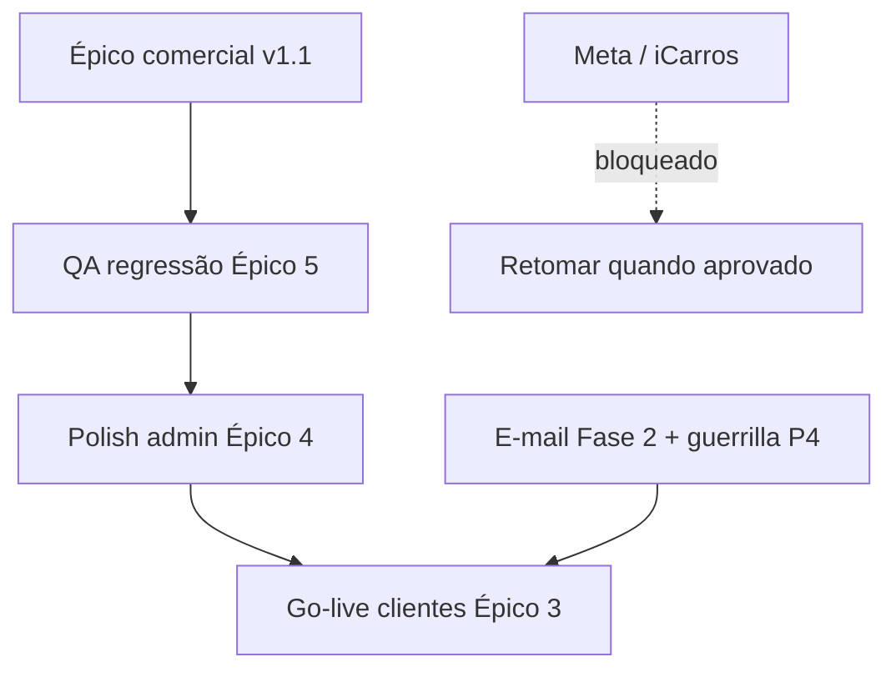

# Backlog — o que falta (jun/2026)

> **Atualizado:** junho/2026 · **Escopo:** tudo mapeado nos épicos, exceto integrações bloqueadas externamente.

---

## Bloqueado — aguardando terceiros

| Item | Motivo | Quando retomar |
| --- | --- | --- |
| **Integração Meta** (Lead Ads / CAPI) | Homologação e credenciais pendentes com suporte Meta | Após aprovação + secrets em prod |
| **Integração iCarros** | Homologação API/publicação pendente com suporte iCarros | Após credenciais e sandbox aprovados |

**Não iniciar** desenvolvimento adicional nessas integrações até liberação do fornecedor.

---

## Épico — Equipe comercial AutoPainel (Platform Sales Squad)

| Fase | Status | Próximo passo |
| --- | --- | --- |
| 1 PM | ✅ | — |
| 2 UX Writer | ✅ | — |
| 3 UX | ✅ | — |
| 4 Arquiteto / DB | ✅ migração `20260620180100` | — |
| **5 Backend** | ✅ **Entregue** | Actions + data layer + auth + hook churn |
| **6 Frontend admin** | ✅ v1 entregue |
| **6 Frontend rep** | ✅ v1 entregue |
| **8 QA** | ✅ Matriz + E2E + RLS script — `PLATFORM_SALES_SQUAD_QA.md` |
| 7 DevOps | ✅ Cron comissão/lote v1.1 — `platform-sales-cron.yml` + RPCs `20260620190400` |

**v1.1 entregue (2026-06-20):**

- RPCs `generate_monthly_commission_ledger`, `generate_payout_batch`, `mark_payout_batch_paid`, `provision_attribution_from_signed_contract`
- Cron GitHub Actions dia 1 e dia 10 — `npm run platform-sales:cron:monthly` / `platform-sales:cron:payout`
- Lead `won` → sheet vínculo em `/painel/leads-comerciais`
- Contrato assinado → vínculo automático (rep + loja no formulário de assinatura)

**Backlog opcional pós-v1.1:**

- Campanhas de incentivo (UI admin)
- Notificações e-mail rep (copy reservada PRD)

**Paths v1 (referência):**

- `apps/admin-master/src/actions/platform-sales-*.ts`
- `apps/admin-master/src/lib/data/platform-sales-squad*.ts`
- Hook churn: `updateDealershipAction` → `runDealershipChurnClawback`

---

## Épicos já entregues (base)

| Épico | Estado |
| --- | --- |
| CRM loja (fases A–D) | ✅ |
| Workers OLX / Webmotors | ✅ |
| Crescimento P0–P4 (exc. guerrilla) | ✅ |
| Marketing site + preços públicos | ✅ |
| Demos estoque showcase (60 veículos) | ✅ |
| Share vitrine (WhatsApp, redes, copiar link) | ✅ |
| Contratos B2B admin | ✅ |
| Leads comerciais B2B admin | ✅ |
| Vitrine inativa + painel suspenso | ✅ |

---

## Parcial — pode continuar agora

| Área | O que falta | Prioridade sugerida |
| --- | --- | --- |
| **Épico 3 go-live** | ✅ Smoke HTTP + E2E login demo (`smoke:production-go-live`); pendente: 1ª loja cliente real fora demos | Operacional |
| **Épico 4 polish admin** | ✅ EmptyState listagens + `fetchDealershipsForAdminList` (select enxuto) | Fechado (base) |
| **Épico 5 QA** | E2E admin-master instável local (timeout 3001); matriz integrações | P1 |
| **INT auto-publish portais** | Homologação OLX/WM já ok; falta fluxo auto-publish completo | P2 |
| **E-mail Auth Fase 2** | Templates transacionais whitelabel painel | P2 |
| **Guerrilla marketing P4** | Campanha pendente no PRD crescimento | P3 |

---

## Ordem recomendada de execução (sem Meta/iCarros)

Próximos passos sugeridos:

1. **Deploy remoto** — `npm run supabase:deploy` (migração `20260620190400`) + push Vercel admin
2. **QA E2E** — reiniciar admin-master (:3001) + `npm run seed:platform-sales-rep-qa` antes da suite completa
3. **Polish admin** — empty states, performance
4. **Go-live** — primeira loja cliente fora das demos
5. **E-mail Fase 2 + guerrilla P4**

---

## Referências

| Doc | Conteúdo |
| --- | --- |
| `PRD_PLATFORM_SALES_SQUAD.md` | Regras de negócio |
| `PLATFORM_SALES_SQUAD_ARCHITECTURE.md` | RPCs, RLS, prompts |
| `UX_PLATFORM_SALES_SQUAD.md` | Wireframes / fluxos |
| `UX_COPY_PLATFORM_SALES_SQUAD.md` | Microcopy pt-BR |
| `documentacao-tecnica.md` | Rastreabilidade viva |
