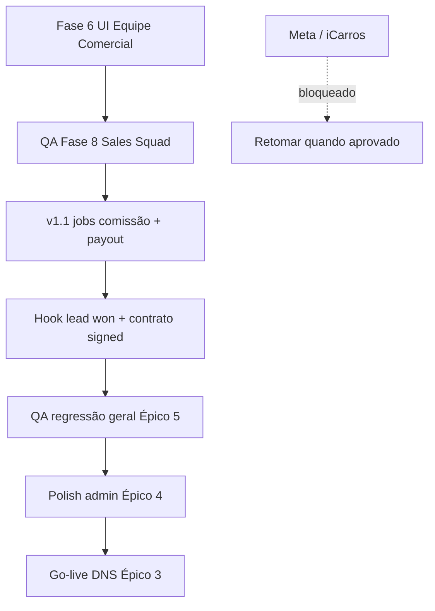

# Backlog — o que falta (jun/2026)

> **Atualizado:** junho/2026 · **Escopo:** tudo mapeado nos épicos, exceto integrações bloqueadas externamente.

---

## Bloqueado — aguardando terceiros

| Item | Motivo | Quando retomar |
| --- | --- | --- |
| **Integração Meta** (Lead Ads / CAPI) | Homologação e credenciais pendentes com suporte Meta | Após aprovação + secrets em prod |
| **Integração iCarros** | Homologação API/publicação pendente com suporte iCarros | Após credenciais e sandbox aprovados |

**Não iniciar** desenvolvimento adicional nessas integrações até liberação do fornecedor.

---

## Épico — Equipe comercial AutoPainel (Platform Sales Squad)

| Fase | Status | Próximo passo |
| --- | --- | --- |
| 1 PM | ✅ | — |
| 2 UX Writer | ✅ | — |
| 3 UX | ✅ | — |
| 4 Arquiteto / DB | ✅ migração `20260620180100` | — |
| **5 Backend** | ✅ **Entregue** | Actions + data layer + auth + hook churn |
| **6 Frontend admin** | ✅ v1 entregue |
| **6 Frontend rep** | ✅ v1 entregue |
| **8 QA** | ✅ Matriz + E2E + RLS script — `PLATFORM_SALES_SQUAD_QA.md` |
| 7 DevOps | 🟡 Parcial | Cron comissão mensal + lote pagamento (v1.1) |

**Fase 5 entregue (paths):**

- `apps/admin-master/src/actions/platform-sales-reps.ts`
- `apps/admin-master/src/actions/platform-sales-attributions.ts`
- `apps/admin-master/src/actions/platform-sales-portfolio.ts`
- `apps/admin-master/src/actions/platform-sales-ledger.ts`
- `apps/admin-master/src/actions/platform-sales-incentives.ts`
- `apps/admin-master/src/lib/data/platform-sales-squad.ts` + `platform-sales-squad-shared.ts`
- `apps/admin-master/src/lib/auth/require-platform-painel-access.ts` + `require-sales-rep.ts`
- Hook churn: `updateDealershipAction` → `runDealershipChurnClawback`

**v1.1 (opcional, pós-UI):**

- RPC/job `generate_monthly_commission_ledger` (cron dia 1)
- RPC/job `generate_payout_batch` + `mark_payout_batch_paid` (cron dia 10)
- Lead B2B `won` → drawer vínculo comercial em `/painel/leads-comerciais`
- Contrato `signed` → attribution automática

---

## Épicos já entregues (base)

| Épico | Estado |
| --- | --- |
| CRM loja (fases A–D) | ✅ |
| Workers OLX / Webmotors | ✅ |
| Crescimento P0–P4 (exc. guerrilla) | ✅ |
| Marketing site + preços públicos | ✅ |
| Demos estoque showcase (60 veículos) | ✅ |
| Share vitrine (WhatsApp, redes, copiar link) | ✅ |
| Contratos B2B admin | ✅ |
| Leads comerciais B2B admin | ✅ |
| Vitrine inativa + painel suspenso | ✅ |

---

## Parcial — pode continuar agora

| Área | O que falta | Prioridade sugerida |
| --- | --- | --- |
| **Épico 3 go-live** | DNS manual / cutover produção (checklist DevOps) | P1 operacional |
| **Épico 4 polish admin** | UX refinements, empty states, performance listagens | P2 |
| **Épico 5 QA** | Regressão E2E pós-features recentes; matriz integrações | P1 antes de release |
| **INT auto-publish portais** | Homologação OLX/WM já ok; falta fluxo auto-publish completo | P2 |
| **E-mail Auth Fase 2** | Templates transacionais + domínio remetente | P2 |
| **Guerrilla marketing P4** | Campanha pendente no PRD crescimento | P3 |
| **Platform Sales Fase 6** | Telas admin + portal rep | **P0 squad** |

---

## Ordem recomendada de execução (sem Meta/iCarros)

1. **Fase 6** — UI equipe comercial (admin + portal rep) usando copy em `UX_COPY_PLATFORM_SALES_SQUAD.md`
2. **QA Sales Squad** — RLS, repasse, estorno churn, extrato
3. **Jobs v1.1** — comissão recorrente mensal + lote pagamento
4. **Integrações internas** — lead `won`, contrato assinado → attribution
5. **QA geral** — Playwright + checklist integrações (exc. Meta/iCarros)
6. **Polish + go-live** — DNS, e-mail auth, auto-publish

---

## Referências

| Doc | Conteúdo |
| --- | --- |
| `PRD_PLATFORM_SALES_SQUAD.md` | Regras de negócio |
| `PLATFORM_SALES_SQUAD_ARCHITECTURE.md` | RPCs, RLS, prompts |
| `UX_PLATFORM_SALES_SQUAD.md` | Wireframes / fluxos |
| `UX_COPY_PLATFORM_SALES_SQUAD.md` | Microcopy pt-BR |
| `documentacao-tecnica.md` | Rastreabilidade viva |
