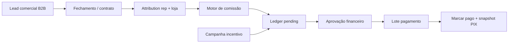

# PRD — Equipe comercial AutoPainel (vendedores internos)

> **Status:** Fase 1 PM **fechada** (jun/2026). Fase 2 UX Writer **entregue** — [`UX_COPY_PLATFORM_SALES_SQUAD.md`](./UX_COPY_PLATFORM_SALES_SQUAD.md).
> **Superfície alvo:** `admin-master` → `/painel/equipe` (separado de `/painel/usuarios` e de `super_admin`).

## 1. Problema

A AutoPainel precisa cadastrar **representantes comerciais internos** (não confundir com vendedores das lojas nem com operadores `super_admin`), vincular lojas que fecharem, calcular comissões, registrar bonificações, saber **quando pagar** e extrair relatórios — com dados bancários seguros para PIX/transferência.

## 2. Escopo desta proposta (Fase 1)

| Incluído | Fora de escopo (v1) |
| --- | --- |
| Modelo de entidades e relacionamentos | Integração contábil / NF de serviço |
| **Comissão recorrente** (MRR enquanto loja ativa na carteira) | Split automático via gateway de pagamento |
| Vínculo rep ↔ loja fechada ↔ contrato/lead | App mobile do vendedor |
| **Repasse de carteira** quando rep sai da empresa | Comissão recorrente parcial proporcional a dias (v1 = mês cheio ou zero) |
| Campanhas de incentivo (metas + bônus) | |
| Ciclo de pagamento e extrato | |
| **Portal do rep — extrato próprio (v1)** | Edição de regras de comissão pelo rep |

## 3. Personas

| Persona | Objetivo |
| --- | --- |
| **Diretor comercial** | Ver pipeline fechado por rep, aprovar pagamentos, criar campanhas |
| **Representante (squad)** | Saber quanto vai receber, prazo e histórico |
| **Financeiro AutoPainel** | Exportar CSV, conferir PIX/dados bancários, marcar pago |
| **Operador admin (`super_admin`)** | Gerir operadores técnicos — **não** entra neste módulo |

## 4. Separação de conceitos (crítico)

| Entidade | Onde vive hoje | Papel |
| --- | --- | --- |
| `profiles.role = super_admin` + `dealership_id IS NULL` | Auth + profiles | Acesso ao **painel administrativo** |
| `profiles.role IN (owner, manager, seller)` + `dealership_id` | Auth + profiles | Usuário da **loja cliente** |
| **`platform_sales_reps`** (novo) | Tabela dedicada | **Funcionário comercial** AutoPainel |

Um rep comercial **pode** ter login (`auth.users`) opcional no futuro (`sales_rep.user_id`), mas o cadastro comercial não depende de ser `super_admin`.

## 5. Modelo de dados proposto

### 5.1 `platform_sales_reps`

Cadastro mestre do vendedor interno.

| Coluna | Tipo | Notas |
| --- | --- | --- |
| `id` | uuid PK | |
| `full_name` | text NOT NULL | |
| `email` | text NOT NULL UNIQUE | Contato + futuro login |
| `phone` | text | WhatsApp |
| `document_cpf` | text | CPF (criptografar ou vault) |
| `status` | enum | `active`, `inactive`, `onboarding` |
| `hire_date` | date | |
| `termination_date` | date NULL | |
| `default_commission_rate_bps` | int | Ex.: 1000 = 10% sobre 1ª mensalidade |
| `user_id` | uuid NULL FK → auth.users | Opcional: portal do rep |
| `notes` | text | |
| `created_at`, `updated_at` | timestamptz | |

### 5.2 `platform_sales_rep_bank_accounts`

Dados de pagamento (1 ativo por rep; histórico versionado).

| Coluna | Tipo | Notas |
| --- | --- | --- |
| `id` | uuid PK | |
| `sales_rep_id` | uuid FK | |
| `payment_method` | enum | `pix`, `ted` |
| `pix_key_type` | enum NULL | `cpf`, `email`, `phone`, `random` |
| `pix_key` | text NULL | Mascarar na UI |
| `bank_code`, `branch`, `account_number` | text NULL | TED |
| `account_holder_name` | text | |
| `account_holder_document` | text | |
| `is_primary` | boolean | |
| `valid_from` | date | |
| `valid_until` | date NULL | |

**Segurança:** RLS restrita a `super_admin`; considerar coluna criptografada ou Supabase Vault para chaves PIX completas.

### 5.3 `platform_sales_rep_dealership_attributions`

Vínculo **rep ↔ loja fechada** (fonte da comissão).

| Coluna | Tipo | Notas |
| --- | --- | --- |
| `id` | uuid PK | |
| `sales_rep_id` | uuid FK | |
| `dealership_id` | uuid FK → dealerships | Loja fechada |
| `commercial_lead_id` | uuid NULL FK | Se veio do CRM B2B |
| `contract_id` | uuid NULL FK | Contrato assinado |
| `attribution_type` | enum | `closer`, `sdr`, `referral` |
| `attribution_share_bps` | int | 10000 = 100% do bucket da loja |
| `closed_at` | timestamptz | Data do fechamento |
| `first_invoice_amount_cents` | int NULL | Base de cálculo |
| `plan_key` | text NULL | Snapshot do plano |
| `status` | enum | `pending`, `confirmed`, `disputed`, `cancelled` |
| `created_at` | timestamptz | |

**Regra:** uma loja pode ter 1+ reps com split (ex.: SDR 30% + closer 70%).

### 5.4 `platform_sales_rep_portfolio_transfers`

Histórico de **repasse de carteira** quando um representante deixa a empresa ou transferência manual.

| Coluna | Tipo | Notas |
| --- | --- | --- |
| `id` | uuid PK | |
| `from_sales_rep_id` | uuid FK | Rep que perde a carteira |
| `to_sales_rep_id` | uuid FK | Rep que assume |
| `effective_at` | timestamptz | Comissões com competência ≥ esta data vão ao destino |
| `dealership_ids` | uuid[] | Lojas repassadas (ou NULL = todas ativas na carteira) |
| `transferred_by_user_id` | uuid FK | Operador admin que confirmou |
| `notes` | text | |
| `created_at` | timestamptz | |

**Regra:** atualiza `platform_sales_rep_dealership_attributions.sales_rep_id` (ou encerra attribution antiga + cria nova) a partir de `effective_at`. Lançamentos **já pagos** não são alterados.

### 5.5 `platform_commission_rules`

Regras versionadas (não hardcoded).

| Coluna | Tipo | Notas |
| --- | --- | --- |
| `id` | uuid PK | |
| `name` | text | Ex.: "Setup + 1ª mensalidade 2026-Q2" |
| `applies_to_plan_key` | text NULL | NULL = todos |
| `calculation_type` | enum | `percent_mrr_recurring`, `fixed_setup`, `percent_first_invoice` |
| `rate_bps` | int NULL | % sobre mensalidade (recorrente) |
| `fixed_amount_cents` | int NULL | |
| `mrr_months` | int NULL | Legado — preferir recorrente sem limite enquanto ativo |
| `valid_from`, `valid_until` | date | |
| `is_active` | boolean | |

### 5.6 `platform_commission_ledger_entries`

Linha contábil imutável (crédito/débito).

| Coluna | Tipo | Notas |
| --- | --- | --- |
| `id` | uuid PK | |
| `sales_rep_id` | uuid FK | |
| `attribution_id` | uuid NULL FK | |
| `campaign_id` | uuid NULL FK | |
| `entry_type` | enum | `commission`, `bonus`, `adjustment`, `clawback` |
| `amount_cents` | int | Pode ser negativo (estorno) |
| `currency` | text | `BRL` |
| `description` | text | |
| `reference_month` | date | Competência (1º dia do mês) |
| `status` | enum | `pending`, `approved`, `paid`, `cancelled` |
| `created_at` | timestamptz | |

### 5.7 `platform_incentive_campaigns`

Campanhas temporárias.

| Coluna | Tipo | Notas |
| --- | --- | --- |
| `id` | uuid PK | |
| `name` | text | Ex.: "Março — 3 setups = bônus R$ 500" |
| `starts_at`, `ends_at` | timestamptz | |
| `goal_metric` | enum | `closed_dealerships`, `mrr_total_cents`, `setup_count` |
| `goal_target` | int | |
| `bonus_amount_cents` | int | |
| `eligible_rep_ids` | uuid[] NULL | NULL = todos ativos |
| `status` | enum | `draft`, `active`, `closed` |

Quando meta atingida → job gera `ledger_entry` tipo `bonus`.

### 5.8 `platform_payout_batches` + `platform_payout_batch_items`

Pagamentos agrupados por ciclo.

| Tabela | Propósito |
| --- | --- |
| `platform_payout_batches` | Ex.: "Pagamento 2026-06-10" — `payment_date`, `status` (`draft`, `processing`, `paid`) |
| `platform_payout_batch_items` | `ledger_entry_id`, `sales_rep_id`, `amount_cents`, `bank_account_snapshot` jsonb |

**Ciclo sugerido:** fechamento dia **5** (competência mês anterior), pagamento dia **10** (configurável em `platform_payout_settings`).

## 6. Fluxos principais

## 7. Relatórios (v1)

| Relatório | Dimensões |
| --- | --- |
| Extrato por rep | mês, tipo, loja, valor, status |
| Fechamentos por rep | período, plano, MRR |
| Campanhas | meta vs realizado, bônus gerados |
| Lote de pagamento | CSV: rep, CPF, PIX, valor |

## 8. Regras de negócio (BZ — aprovadas PM)

- **BZ-SQ-01:** Rep só recebe comissão com `attribution.status = confirmed` e loja em status que gera faturamento (`active`; `pending` conforme integração contrato — PM validar na Fase 4).
- **BZ-SQ-02:** **Comissão recorrente** — todo mês, enquanto a loja estiver ativa **e** vinculada à carteira do representante, gera lançamento `commission` na competência do mês.
- **BZ-SQ-03:** **Churn em 30 dias** — cancelamento/encerramento da loja em até 30 dias após `closed_at` → estorno **total** das comissões já creditadas (paid ou approved) via `clawback` no extrato.
- **BZ-SQ-04:** **Repasse de carteira** — operador move lojas de rep A para rep B com `effective_at`; rep A para de receber comissões futuras dessas lojas; rep B recebe a partir da competência seguinte ao repasse (detalhe na Fase 4).
- **BZ-SQ-05:** Split entre reps na mesma loja: soma de `attribution_share_bps` ≤ 10000.
- **BZ-SQ-06:** Dados bancários só visíveis para `super_admin` + role futuro `finance_admin`; rep vê e edita **apenas os próprios** dados.
- **BZ-SQ-07:** Operador `super_admin` ≠ representante comercial; cadastros separados.
- **BZ-SQ-08:** **Portal v1** — rep com login (`sales_rep.user_id`) acessa **somente** `/painel/comercial/extrato` + dados bancários próprios (read/update).

## 9. Superfícies afetadas (pós-aprovação)

| App | Mudança |
| --- | --- |
| `admin-master` | `/painel/equipe/comercial` — CRUD reps, atribuições, campanhas, lotes |
| `admin-master` | `/painel/comercial/extrato` — portal do rep (login dedicado) |
| `admin-master` | Integração com `/painel/leads-comerciais` e `/painel/contratos` |
| `dealership-panel` | Nenhuma (vendedor da loja continua separado) |
| `customer-site` / marketing | Nenhuma |

## 10. Critérios de aceite (happy path)

1. Cadastrar rep com PIX → aparece na lista Equipe comercial.
2. Fechar loja X atribuindo rep Y → gera ledger `pending` com valor calculado pela regra vigente.
3. Aprovar ledger → entra no lote do dia 10.
4. Exportar CSV do lote com chaves mascaradas + download seguro completo para financeiro.
5. Campanha "3 setups no mês" → ao 3º fechamento, bônus entra no ledger.
6. Rep A sai → repasse carteira para Rep B → comissões futuras só para B; extrato de A preserva histórico pago.
7. Rep logado vê **Meu extrato** com lançamentos pending/approved/paid da própria carteira.

## 11. Decisões PM (fechadas)

| # | Pergunta | Decisão |
| --- | --- | --- |
| 1 | Comissão 1ª mensalidade ou recorrente? | **Recorrente** (MRR mensal enquanto loja ativa na carteira) |
| 2 | Rep vê extrato na v1? | **Sim** — portal `/painel/comercial/extrato` |
| 3 | Churn 30 dias? | **Sim** — estorno total das comissões creditadas |
| 4 | Rep sai da empresa? | **Repasse de carteira** para outro rep; anterior deixa de receber comissões futuras |
| 5 | CPF / PIX | Armazenar cifrado ou mascarado; rep edita próprio PIX; financeiro exporta lote |
| 6 | Evento `confirmed` | Integração contrato/lead — definir na Fase 4 (disparo ao assinar ou ativar loja) |

## 12. Próximas fases squad

| Fase | Entrega | Status |
| --- | --- | --- |
| 2 UX Writer | Microcopy pt-BR | ✅ [`UX_COPY_PLATFORM_SALES_SQUAD.md`](./UX_COPY_PLATFORM_SALES_SQUAD.md) |
| 3 UX | Telas, jornadas, estados | ✅ [`UX_PLATFORM_SALES_SQUAD.md`](./UX_PLATFORM_SALES_SQUAD.md) |
| 4 Arquiteto | Migrações + RLS + RPCs | ✅ [`PLATFORM_SALES_SQUAD_ARCHITECTURE.md`](./PLATFORM_SALES_SQUAD_ARCHITECTURE.md) · `20260620180000_platform_sales_squad.sql` |
| 5 Backend | Server actions + jobs | ⏳ Após aplicar migração no Supabase |

---

**Implementado neste batch (fora deste PRD):** listagem/remoção de usuários Auth (`/painel/usuarios`, `/painel/equipe` operadores) + cleanup de perfis órfãos para destravar exclusão de concessionárias.
