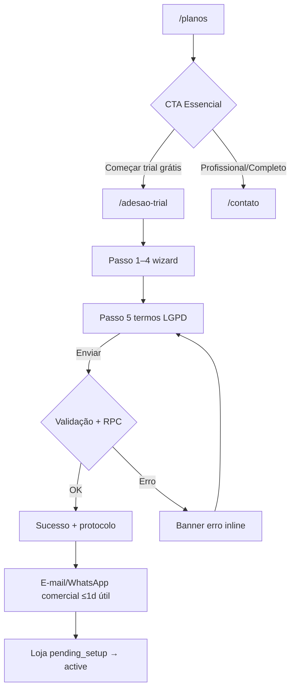
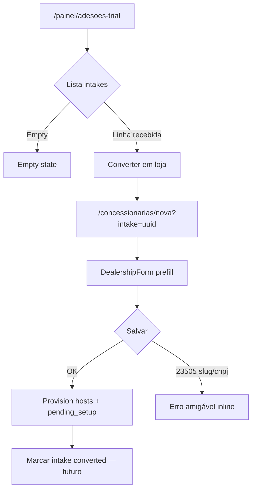

# UX Design — Campanha Trial Essencial (Fase 3)

> **Pré-requisitos:** PRD `BZ-TR-001…006` · Microcopy `TRIAL_ONBOARDING_UX_COPY.md`  
> **Versão:** 1.0 · junho/2026 · **Sem código** — handoff para Arquiteto / Frontend

---

## 1. Apps afetados e personas

| App | Persona | Objetivo nesta feature |
| --- | --- | --- |
| **marketing-site** | Dono(a) / gestor(a) de concessionária (prospect B2B) | Entender valor dos planos, iniciar trial grátis 30 dias, enviar cadastro completo da loja |
| **marketing-site** | Visitante comparando planos | Ver módulos por tier e diferenciais (Essencial enriquecido) |
| **admin-master** | Super admin / comercial AutoPainel | Revisar adesões, vincular a lead, converter em concessionária com prefill |
| **admin-master** | Comercial (leads pipeline) | Acompanhar lead `trial_onboarding` em estágio Onboarding |
| **customer-site** | Comprador final | Navegar vitrine com todos os blocos de texto; ler privacidade/termos claros (LGPD) |
| **dealership-panel** | Operador da loja (pós-provision) | *(Fora do fluxo principal)* Usar módulos Essencial após ativação — não bloqueia UX desta fase |

**Persona primária do épico:** prospect lojista no marketing-site → operador comercial no admin.

---

## 2. Jornadas por persona

### 2.1 Prospect lojista — trial completo



| Passo | Ação do usuário | Resposta do sistema | UI / copy (UX Writer) |
| --- | --- | --- | --- |
| 1 | Abre `/planos` | SSR catálogo DB ou fallback estático | Tabela módulos; badge «Em breve» iCarros/Meta |
| 2 | Clica «Começar trial grátis» (Essencial) | Navega `/adesao-trial` | Hero campanha + wizard |
| 3 | Preenche passos 1–4 | Estado local React; «Continuar» sem persistência server | Stepper 1–5; hints por campo §3.3–3.6 |
| 4 | Aceita 3 checkboxes obrigatórios + envia | `submitTrialOnboardingAction`: RPC intake → uploads → lead B2B | Loading «Enviando…»; botão disabled |
| 5a | Sucesso | `intake` + `saas_prospect` pipeline `onboarding` | «Adesão recebida!» + protocolo |
| 5b | Erro validação/LGPD | Mensagem específica no banner vermelho | §7.1 UX Copy |
| 5c | Erro upload | Intake já criado; mensagem amigável | Sugerir reenvio arquivos via comercial |

**Estados de loading:** apenas no submit final (overlay botão + `aria-busy`). Passos intermediários sem skeleton — formulário client-side.

---

### 2.2 Comercial AutoPainel — converter adesão



| Passo | Ação | Resposta | UI |
| --- | --- | --- | --- |
| 1 | Menu «Adesões trial» | Lista até 200 intakes | Tabela admin |
| 2 | «Converter em loja» | Nova concessionária com banner verde prefill | Revisar abas Geral / Vitrine / Plano |
| 3 | Ajusta slug se conflito | Validação unique | Copy slug ocupado §5.2 |
| 4 | Salva | `createDealershipAction` + provision background | Toast sucesso §5.3 |
| 5 | Lead comercial | Já em `onboarding` via metadata `intake_id` | `/painel/leads-comerciais` |

---

### 2.3 Comprador — vitrine pós-onboarding

| Passo | Contexto | Experiência |
| --- | --- | --- |
| 1 | Homepage layout 1, 2 ou 3 | Hero + trust strip + financiamento + história + estoque (textos preenchidos no intake) |
| 2 | `/politica-de-privacidade` | Controladora = loja; operadora/detentora = AutoPainel |
| 3 | Formulário lead veículo | Dados processados conforme política revisada |

---

## 3. Inventário de telas e componentes

Legenda **DS:** `@autopainel/shared/ui` · **Novo shared:** criar em `packages/shared` · **App-local:** específico do app

### 3.1 marketing-site

| Componente / tela | App | Estados obrigatórios | Interações | Permissão | DS |
| --- | --- | --- | --- | --- | --- |
| **PlanosPage** | marketing | loading (SSR), success, error fallback static | Scroll, CTA cards, FAQ link | anon | Page layout local |
| **PlansModuleTable** | marketing | success (DB/static), empty modules improvável | Scroll horizontal tabela mobile | anon | `Table`, `Badge`, `Button`, `AnalyticsTrackedLink` |
| **ModuleComingSoonBadge** | marketing | — | Tooltip title §2.1 copy | anon | `Badge` reuse |
| **AdesaoTrialPage** | marketing | success (form mount) | — | anon | Hero + `TrialOnboardingForm` |
| **TrialOnboardingForm** | marketing | steps 0–4, submitting, success, error | Voltar/Continuar/Enviar; file inputs | anon | `Button`, `Input`, `Label`, `Textarea` |
| **TrialStepper** | marketing | current, completed, upcoming | Indicador visual only | anon | **Novo shared:** `Stepper` ou `ProgressSteps` (pills reutilizáveis) |
| **TrialFormSection** | marketing | — | Card wrapper passo | anon | `Card` |
| **TrialFileUploadField** | marketing | empty, preview blob, error size/mime | Escolher arquivo + hint spec | anon | **Novo shared:** `MarketingFileUploadField` (label, hint, accept, max) — padrão `DealershipBrandUpload` |
| **TrialLayoutPreview** | marketing | layout 1/2/3 selected | Select + mini preview | anon | **Adaptar:** extrair mini preview de `DealershipTemplatePicker` → `StorefrontLayoutPreview` em shared |
| **TrialTrustStatsFields** | marketing | 0–4 pares valor/rótulo | Add/remove rows passo 3 | anon | **Novo shared:** `KeyValueRepeater` (genérico) |
| **TrialSidecardFields** | marketing | layout 1 only | 3 bullets + título | anon | `Input` + condicional layout |
| **TrialUnitRepeater** | marketing | 0..n unidades | Add/remove; checkbox matriz | anon | **Novo shared:** `RepeaterFieldGroup` |
| **TrialLegalConsentBlock** | marketing | unchecked, checked, error | 3 obrigatórios + 1 opcional | anon | Reuse padrão `ConsentCheckboxGroup` |
| **TrialSuccessPanel** | marketing | success | Link `/planos` | anon | `Button` + Card |
| **TermoAdesaoTrialPage** | marketing | static | Link voltar formulário | anon | `LegalPageLayout` existente |

### 3.2 admin-master

| Componente / tela | App | Estados | Interações | Permissão | DS |
| --- | --- | --- | --- | --- | --- |
| **AdesoesTrialPage** | admin | loading, empty, success, error fetch | Ordenação por data | super admin | `Table`, `Button` |
| **IntakeStatusBadge** | admin | submitted/linked/converted/archived | — | super admin | `Badge` variant map |
| **IntakeConvertButton** | admin | default, converted (Ver loja) | Link nova/editar | super admin | `Button` |
| **DealershipIntakePrefillBanner** | admin | visible com intake | Read-only protocolo | super admin | Alert local (Card border emerald) |
| **DealershipForm** (create + intake) | admin | create prefilled, pending save, error | Tabs geral/vitrine/plano/unidades | super admin | Existente + `StorefrontHomeContentFields`, `DealershipTemplatePicker`, masked inputs |
| **PlatformCommercialLeadsTable** | admin | — | Badge origem trial *(futuro)* | super admin | Existente |
| **LinkIntakeToLeadSheet** *(futuro)* | admin | lead picker | Vincular manualmente | super admin | `Sheet`, `Command` |

### 3.3 customer-site

| Componente | App | Estados | Interações | DS |
| --- | --- | --- | --- | --- |
| **StorefrontHomeLayout** | customer | loading vehicles, success, empty estoque | Scroll | Composição existente |
| **HomeHero / TrustStrip / FinancePromo / Heritage** | customer | copy resolved | CTAs | Existente pós-ajuste layouts 1–3 |
| **StorefrontLegalPageLayout** | customer | static | — | Existente |
| **PoliticaDePrivacidade / TermosDeUso** | customer | tenant name inject | — | Copy §6 UX Writer |

### 3.4 dealership-panel

| Componente | Nota |
| --- | --- |
| Module gates Essencial | Sem mudança UX neste épico — trial herda módulos via `pricing_plan_id` starter/trial |
| `/conta-inativa` | Se loja criada `pending_setup` até pagamento/go-live |

---

## 4. Mapeamento design system

### 4.1 Reuso imediato (sem novo primitive)

| Necessidade | Primitivas shared |
| --- | --- |
| Wizard actions | `Button`, `Button variant="outline"` |
| Campos texto | `Input`, `Textarea`, `Label` |
| Tabela planos / adesões | `Table`, `Badge` |
| Admin dialogs confirmação | `ConfirmActionDialog` |
| Toasts admin | `toast` (sonner) |
| Links trackados marketing | `AnalyticsTrackedLink` (shared components) |
| Template picker admin | `DealershipTemplatePicker` (admin, espelhar preview no marketing) |

### 4.2 Novos componentes — flag `packages/shared`

| Componente proposto | Justificativa | Composição |
| --- | --- | --- |
| **`Stepper` / `ProgressSteps`** | Wizard trial + futuros onboarding | Pills + aria `aria-current="step"` |
| **`StorefrontLayoutPreview`** | Marketing trial + admin picker DRY | Mini wireframe SVG/div — extrair de `DealershipTemplatePicker` |
| **`FileUploadField`** | Logos, hero, favicon — marketing + admin | Label, hint, accept, preview, hidden URL opcional |
| **`KeyValueRepeater`** | Trust stats, heritage stats | 2 inputs por linha + add/remove |
| **`BrazilianAddressFields`** *(já existe no admin)* | Passo 1 cobrança + unidades trial | **Mover/exportar** de admin para shared — usado em 3 apps |
| **`IntakeStatusBadge`** | Admin listagens | Map status → variant Badge |

**Não criar em app:** `TrialOnboardingForm` pode permanecer em `marketing-site` mas **deve consumir** shared fields acima.

---

## 5. Whitelabel e customização tenant

| Elemento | Customizável no trial form | Onde aparece | Restrição UX |
| --- | --- | --- | --- |
| Nome loja | Sim | Hero `{nome_loja}`, header, legal | Truncar mobile >40 chars com tooltip |
| Cores primária/secundária/texto | Sim | CSS vars vitrine | Preview ao vivo *(fase frontend)* |
| Logos claro/escuro/rodapé/favicon | Sim | Header, footer, tab | Fallback monograma 2 letras se vazio |
| Google Fonts | Sim | heading/body | Combobox admin — trial: input texto validado |
| Tema claro/escuro | Sim | Superfície vitrine | Toggle visual passo 3 |
| Layout 1/2/3 | Sim | Estrutura homepage | Preview obrigatório antes de enviar |
| Textos homepage | Sim por layout | Todos layouts mostram mesmos blocos | Layout só muda **disposição**, não omite copy |
| Domínio custom | Opcional | Pós-aprovação | Não bloquear trial no subdomínio |

**Plataforma fixa:** marketing-site mantém identidade AutoPainel; admin-master shell global; badge «Em breve» cor amber marketing token.

---

## 6. Responsivo

### marketing-site

| Breakpoint | `/planos` | `/adesao-trial` |
| --- | --- | --- |
| **Mobile (<768px)** | Tabela módulos scroll horizontal; cards planos empilhados 1 col | Stepper wrap; campos 1 col; file inputs full width; sticky footer «Continuar» *(recomendado)* |
| **Tablet (768–1024px)** | Cards 2–3 col; tabela legível | Grid 2 col em cores branding |
| **Desktop (>1024px)** | max-w-6xl; cards 3 col | max-w-3xl form; conforto leitura termos |

### admin-master

| Breakpoint | Adesões trial | Nova concessionária |
| --- | --- | --- |
| Mobile | Tabela scroll; ação em botão full width | Form tabs — preferir desktop |
| Desktop | Tabela completa | Sidebar + form multi-tab — **primário** |

### customer-site

| Breakpoint | Homepage |
| --- | --- |
| Mobile | Hero stack; trust strip scroll horizontal se >3 stats |
| Desktop | Layouts 1/2/3 conforme template |

---

## 7. Edge cases (copy UX Writer — não inventar)

| Situação | Onde | O que o usuário vê |
| --- | --- | --- |
| Nenhuma adesão admin | `/painel/adesoes-trial` | Headline: «Nenhuma adesão trial ainda» · Corpo §5.1 · CTA «Ver leads comerciais» |
| Só uma unidade | Passo 4 trial | «Só uma unidade?» + pular §3.6 |
| Termos não aceitos | Submit | Erros §7.1 por checkbox |
| Slug duplicado na conversão | Admin nova loja | «Este subdomínio já está em uso…» §5.2 |
| Upload falha pós-intake | Trial submit | «Não foi possível enviar a imagem agora…» §7.1 |
| Módulo iCarros/Meta | `/planos` | Badge «Em breve» — sem CTA falso |
| Recibo no Essencial | FAQ / contato | Module-gated §2.4 marketing |
| Loja inativa pós-trial | customer-site + panel | Fluxos existentes `/loja-inativa`, `/conta-inativa` |
| Permissão negada admin | adesões | RLS — redirect login; nunca raw 403 |

---

## 8. Wireframe textual — wizard `/adesao-trial` (desktop)

```
┌─────────────────────────────────────────────────────────┐
│ [Campanha · Plano Essencial]                            │
│ Trial grátis por 30 dias                                │
│ Lead paragraph…                                         │
├─────────────────────────────────────────────────────────┤
│ (1 Dados)(2 Visual)(3 Vitrine)(4 Instit.)(5 Confirm.)   │
├─────────────────────────────────────────────────────────┤
│ ┌─ Card passo ─────────────────────────────────────┐  │
│ │ Título seção                                        │  │
│ │ [campos + hints]                                    │  │
│ │ [LayoutPreview 1|2|3]  ← passo 3                    │  │
│ └─────────────────────────────────────────────────────┘  │
│ [Voltar]                              [Continuar/Enviar] │
└─────────────────────────────────────────────────────────┘
```

**Passo 3 — ordem visual recomendada:** Tema → Layout + preview → Hero upload → Hero copy → Trust stats → Financiamento → História.

---

## 9. Analytics / GTM (notas UX)

| Evento sugerido | Quando |
| --- | --- |
| `trial_form_step_view` | step 0–4 |
| `trial_form_submit` | envio OK |
| `trial_form_error` | banner erro |
| `plan_cta_trial_click` | card Essencial |
| `intake_convert_click` | admin |

*(Implementação DevOps/GTM — fora escopo UX, registrar para Arquiteto frontend.)*

---

## 10. Checklist handoff

| Para | Entrega |
| --- | --- |
| **Arquiteto Supabase** | Confirmar schema intake + RPC; campos JSON payload vs colunas; marcar `converted` pós-create; link manual intake↔lead |
| **Backend** | Validações server; upload; masked CNPJ; atualizar intake status |
| **Frontend marketing** | Completar campos §3.5 UX Copy; Stepper shared; LayoutPreview; sticky mobile CTA |
| **Frontend admin** | IntakeStatusBadge; toast; marcar converted; sheet vincular lead |
| **Frontend customer** | Já alinhado layouts 1–3 — validar QA visual com textos intake |

---

## 11. Aprovação

Design baseado em PRD + microcopy aprovados. Componentes novos flagged para `packages/shared` antes de implementação nos apps.

*Próxima fase sugerida: **Arquiteto Supabase** — revisar contratos existentes (`dealership_onboarding_intakes`, RPCs), gaps (status `converted`, link lead manual, tipos payload completos) e migrations pendentes.*
